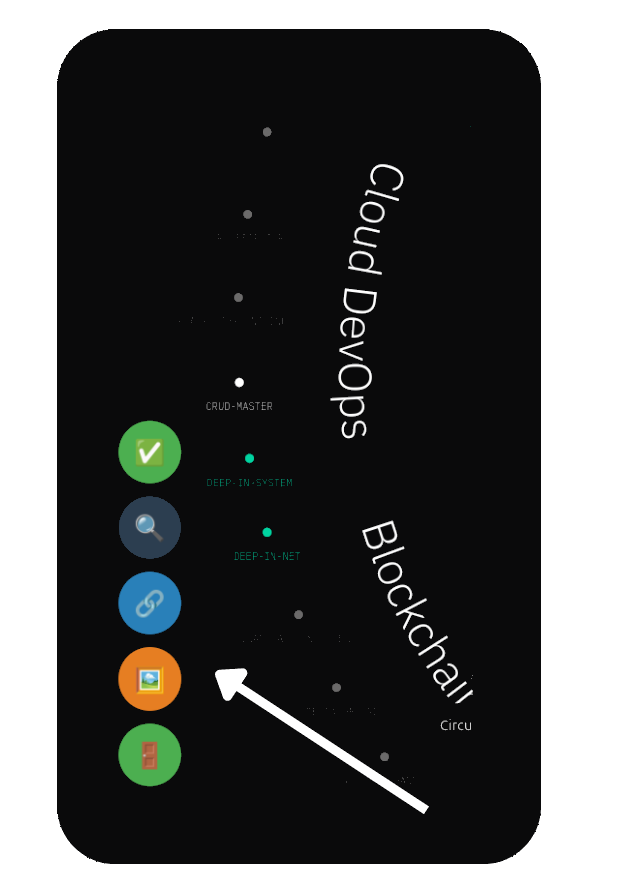

    

# Reboot01 Enhancer

A powerful browser extension designed to enhance your experience on `learn.reboot01.com`. This extension not only restores the missing "Accept All" button for audits (without the bugs!), but also includes several quality-of-life improvements to make your learning journey smoother and more efficient.

## Key Features

* **Accept All Audits** - Click once to mark all audit options ✅
* **Open All Objects** - Instantly unlock all projects in the graph 🚪
* **Image Fixer** - Automatically repair broken images 🖼️
* **Audit Link Fixer** - Fix broken audit links with one click 🔗
* **Audit Page Opener** - Quick access to audit pages 🔍

## Showcase

    

*A demonstration of how the extension buttons appear on your screen*

## Installation

### Firefox Users
1. Download `R01E_firefox.xpi` from the [Latest Release](https://github.com/amali01/R01-Enhancer/releases/latest)
2. From Firefox's menu, select "Open File..." (or press Ctrl+O)
3. Navigate to the downloaded `.xpi` file and open it
4. Click "Install Now" in the software installation dialog
5. Restart Firefox to complete installation

### Chrome Users
1. Download `R01E_chrome.zip` from the [Latest Release](https://github.com/amali01/R01-Enhancer/releases/latest)
2. Extract (uncompress) the downloaded zip file
3. Open Chrome and navigate to `chrome://extensions/`
4. Enable "Developer mode" using the toggle in the top-right
5. Click "Load unpacked" and select the extracted folder

*Note: After installation, you'll see the extension buttons appear on any learn.reboot01.com page.*

## Author

[amali01](https://github.com/amali01)

## Acknowledgments

*Inspired by [EXTBH's Return-AcceptAll](https://github.com/EXTBH/Return-AcceptAll)*
